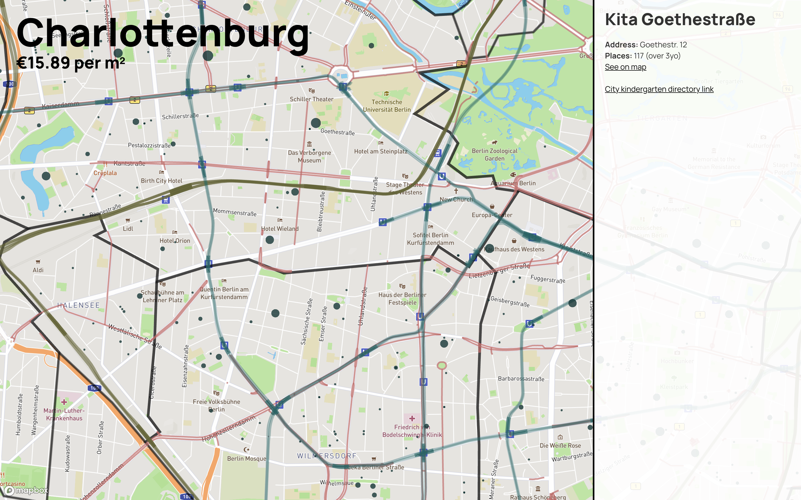

## Berlin districts visualization

A tool for analyzing Berlin housing pricing, public transportation network and kindergarten availability. Based on Berlin open data, visualized using Mapbox, d3 and React.

## Data sources

https://www.wohnungsboerse.net/mietspiegel-Berlin/2825

https://github.com/PatrickStotz/Berlin-A-to-Z/blob/master/ortsteile.json

https://raw.githubusercontent.com/Hennisa/berlin-geodata/master/berlin_postal.geojson

https://gist.github.com/CliffordAnderson/49f26b694e2f1e41ac5c17433aa310fe

http://www.kita-suche.berlin/

https://www.berlin.de/sen/jugend/familie-und-kinder/kindertagesbetreuung/kitas/verzeichnis/FreiePlaetze.aspx

https://fbinter.stadt-berlin.de/fb/wfs/data/senstadt/s06_06ewdichte2018?SERVICE=WFS&VERSION=1.1.0&request=getFeature&TYPENAME=fis:s06_06ewdichte2018

http://insideairbnb.com/get-the-data.html
